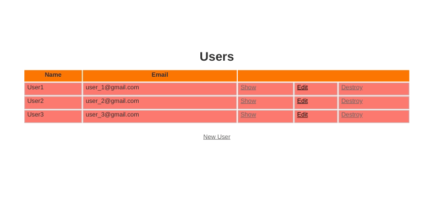

# Toy App

> Microverse ROR Project.

<p align="right">
  <br>
  <a href="https://github.com/ricardovaltierra/toy-demo-app">Explore the repo »</a>
  <br>
  <a href="https://github.com/ricardovaltierra/toy-demo-app/issues">Request Feature</a>
</p>

## Table of Contents

* [About the Project](#about-the-project)

* [Preview](#preview)

* [Built With](#built-with)

* [Getting Started](#getting-started)

* [How it Works](#how-it-works)

* [Contributing](#contributing)

* [Contact](#contact)

* [MIT License](#mit-license)

## About The Project

Toy App to show off some of the ROR features on MCV like scaffolding, routes and REST architecture on a 'Twitter-Style' app with test suite and Heroku deployment. Scaffolding for users and micropost entitites generating models, controllers, CRUD views, assets (JS/SCSS) and test suites.

Once deployed you can navigate on browser to create new users the basic way and save them on your sqlite database, same way with micropost.

Besides the home page view (which is the list of registered users), you can access to views for editing, look or create a specific user.

Same way with micropost. To access (since it's a scaffold quick app) just add `/microposts`. Main view list. Create selecting a registered user and edit / look / delete.

## Preview

 

> [Live](https://small-toy-app.herokuapp.com/)

Feel free to use and recommend it.

### Built With

* [Ruby 2.6.4](https://www.ruby-lang.org/en/news/2019/08/28/ruby-2-6-4-released/)

* [Rails 5.1.6](https://rubygems.org/gems/rails/versions/5.1.6)

* [SCSS](https://developer.mozilla.org/en-US/docs/Web/CSS)

* [SQLite 1.3.13](https://rubygems.org/gems/sqlite3/versions/1.3.13)

* gems:
    * [puma](https://rubygems.org/gems/puma)
    * [spring](https://rubygems.org/gems/spring)
    * [pg (production)](https://rubygems.org/gems/pg)

## Getting Started

To get a local copy up and running follow these simple steps.

Clone or fork the <a href="https://github.com/ricardovaltierra/toy-demo-app">repo</a> [git@github.com:ricardovaltierra/toy-demo-app.git].

## How it Works

This app is built on Rails Scaffolding basis, it needs Sqlite3 to proper use on development and Postgre for production. All good stuff is on `/app` folder.

### Running the code


To get started with the app, clone the repo and then install the needed gems:

```
$ bundle install --without production
```

Next, migrate the database:

```
$ rails db:migrate
```

Finally, run the test suite to verify that everything is working correctly:

```
$ rails test
```

If the test suite passes, you'll be ready to run the app in a local server:

```
$ rails server
```

For more information, see the
[*Ruby on Rails Tutorial* book](https://www.railstutorial.org/book).

## Contributing

Contributions are what make the open source community such an amazing place to learn, inspire, and create. Any contributions you make are **greatly appreciated**.

1. Fork the Project.

2. Create your Feature Branch (`git checkout -b feature/AmazingFeature`).

3. Commit your changes (`git commit -m 'Add some AmazingFeature'`).

4. Push to the Branch (`git push origin feature/AmazingFeature`).

5. Open a Pull Request.

## Contact

Ricardo Valtierra - [@RicardoValtie15](https://twitter.com/RicardoValtie15) - ricardo_valtierra@outlook.com  - [linkedin.com/in/ricardovaltierra/](https://www.linkedin.com/in/ricardovaltierra/)

## MIT License

This project is under the [MIT](LICENSE) license.

